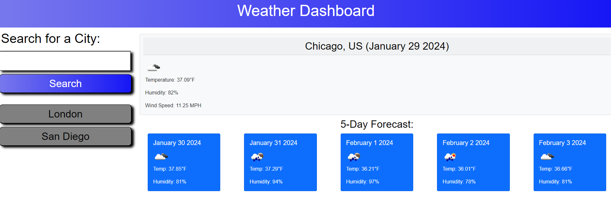

# 5Day-Weather-Forecast

## Description
An app that displays the weather forecast for the next 5 days. Allows the user the input any city name and converts the city name into the corresponding latitude and longitude.

[5 Day Weather Forecast App](https://drewhermanson.github.io/5Day-Weather-Forecast/)

## Usage
This app can be used to find several useful weather information about any given city for the next 5 days. The app will then store previous searches in a side tab to allow easy history access.

## Credit

[OpenWeatherMap API](https://openweathermap.org/forecast5) API used to retrieve weather day.

[Day JS](https://day.js.org/) API used to display current time.

[Bootstrap](https://getbootstrap.com/) CSS stylesheet used in displaying weather information.

## License 

See repository for license information 
